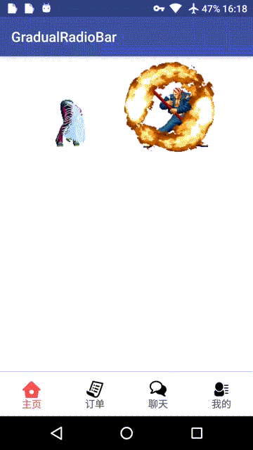

## 简介
修改自[nyakokishi/GradualRadioBar](https://github.com/nyakokishi/GradualRadioBar)，重新计算了icon与文字的位置，设置drawablePadding，paddingTop,paddingBottom后正确显示。
 
## 效果
**没有设置任何padding**


<br/>

**设置drawablePadding**


<br/>

**设置paddingTop与paddingBottom**



## 使用
加入依赖：
```
    compile 'com.achenging.view:gradualradiobar:1.0.1'
```

布局xml:
```

    <com.achenging.view.gradualradiobar.GradualRadioGroup
        android:id="@+id/radiobar"
        android:layout_width="match_parent"
        android:layout_height="wrap_content"
        android:layout_alignParentBottom="true"
        android:orientation="horizontal">

        <com.achenging.view.gradualradiobar.GradualRadioButton
            android:id="@+id/home"
            android:layout_width="0dp"
            android:layout_height="wrap_content"
            android:layout_weight="1"
            android:checked="true"
            android:drawableTop="@mipmap/home"
            android:gravity="center_horizontal"
            android:text="主页"
            android:textColor="#555"
            app:gradual_color="#f75151"/>

        <com.achenging.view.gradualradiobar.GradualRadioButton
            android:id="@+id/order"
            android:layout_width="0dp"
            android:layout_height="wrap_content"
            android:layout_weight="1"
            android:drawableTop="@mipmap/order"
            android:gravity="center_horizontal"
            android:text="订单"
            android:textColor="#555"
            app:gradual_color="#f75151"/>

        <com.achenging.view.gradualradiobar.GradualRadioButton
            android:id="@+id/chat"
            android:layout_width="0dp"
            android:layout_height="wrap_content"
            android:layout_weight="1"
            app:gradual_icon="@mipmap/chat"
            android:gravity="center_horizontal"
            android:text="聊天"
            android:textColor="#555"
            app:gradual_color="#f75151"/>

        <com.achenging.view.gradualradiobar.GradualRadioButton
            android:id="@+id/my"
            android:layout_width="0dp"
            android:layout_height="wrap_content"
            android:layout_weight="1"
            app:gradual_icon="@mipmap/my"
            android:gravity="center_horizontal"
            android:text="我的"
            android:textColor="#555"
            app:gradual_color="#f75151"/>
    </com.achenging.view.gradualradiobar.GradualRadioGroup> 
```


java代码:
```
    gradualRadioGroup = (GradualRadioGroup) findViewById(R.id.radiobar);
    viewPager.setAdapter(adapter);
    // 关键代码
    gradualRadioGroup.setViewPager(viewPager);
```

具体可以查看[demo](https://github.com/achenging/GradualRadioBar/tree/master/demo)


License
============

    Copyright 2017 achenging

    Licensed under the Apache License, Version 2.0 (the "License");
    you may not use this file except in compliance with the License.
    You may obtain a copy of the License at

     http://www.apache.org/licenses/LICENSE-2.0

    Unless required by applicable law or agreed to in writing, software
    distributed under the License is distributed on an "AS IS" BASIS,
    WITHOUT WARRANTIES OR CONDITIONS OF ANY KIND, either express or implied.
    See the License for the specific language governing permissions and
    limitations under the License.